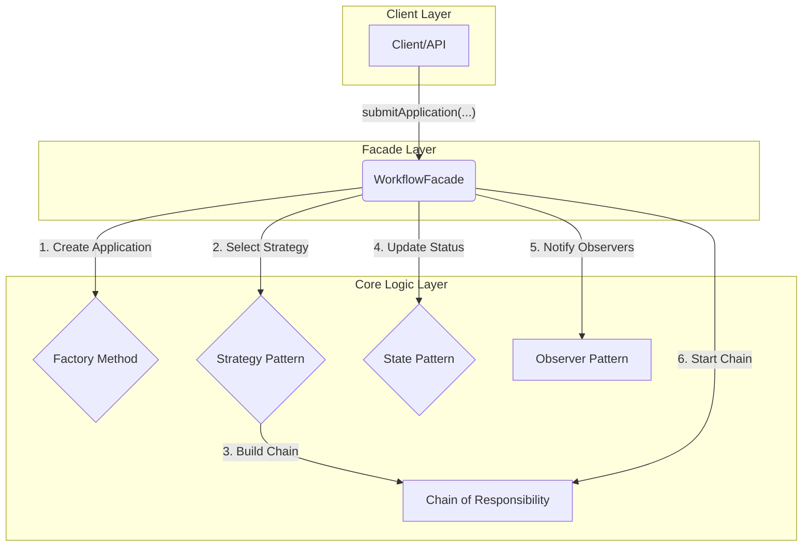

# Configurable-Online-Approval-System
practice - design pattern

## 專案簡介 (Project Introduction)

這是一個以學習和實踐物件導向設計模式為核心目標的 Java 專案。

本專案模擬了一個通用的線上簽核系統，員工可以提交不同類型的申請（如費用報銷、請假、採購），系統則會根據預先配置的業務規則，動態地建立對應的簽核流程。

其核心價值在於展示如何組合運用多種經典設計模式（GoF Design Patterns），來建構一個**高內聚、低耦合、易擴展**的靈活軟體架構。

## 核心功能 (Core Features)

- **多樣化申請單**: 支援費用報銷 (`ExpenseApplication`)、請假 (`LeaveApplication`)、採購 (`ProcurementApplication`) 等多種類型的申請。
- **動態簽核流**: 簽核流程（由誰簽核、簽核順序）並非寫死，而是可以根據申請單的類型、金額等條件動態產生。
- **狀態生命週期管理**: 每張申請單都有嚴格的狀態（草稿、簽核中、已核准、已駁回），並限制了在不同狀態下可執行的操作。
- **事件驅動通知**: 當關鍵事件（如提審、核准）發生時，系統會自動通知相關的下游模組（如日誌記錄器、郵件通知器）。

## 設計模式應用 (Design Patterns Used)

本專案是多個設計模式協同工作的 showcase。以下是核心模式及其職責：

| 模式分類 | 設計模式 | 在本專案中的職責 |
| :--- | :--- | :--- |
| **創建型** | **工廠方法 (Factory Method)** | 負責創建不同種類的申請單物件 (`Application`)，將物件的創建與使用解耦。 |
| | **單例 (Singleton)** | （可選）用於管理全域唯一的資源，如系統配置。 |
| **結構型** | **外觀 (Facade)** | `WorkflowFacade` 作為系統的統一入口，封裝了內部複雜的子系統調用，為客戶端提供一個簡潔的介面。 |
| | **適配器 (Adapter)** | （可選）用於整合介面不相容的第三方通知服務（如 Email, Slack）。 |
| **行為型** | **責任鏈 (Chain of Resp.)** | **(核心)** 構建簽核流程。每個簽核者 (`Approver`) 都是鏈上的一個節點，申請單在鏈上傳遞。 |
| | **狀態 (State)** | **(核心)** 管理申請單的生命週期 (`ApprovalStatus`)。將與特定狀態相關的行為封裝在獨立的狀態類別中。 |
| | **策略 (Strategy)** | **(核心)** 封裝不同的「簽核流程組裝規則」。根據業務條件（如金額）選擇不同的策略，來動態產生責任鏈。 |
| | **觀察者 (Observer)** | **(核心)** 實現事件驅動的通知機制。當申請單狀態改變時，`EventManager` 會通知所有已註冊的觀察者（如日誌、郵件）。 |
| | **命令 (Command)** | （可選）將「核准」、「駁回」等操作封裝成物件，便於日誌記錄、撤銷等。 |
| | **備忘錄 (Memento)** | （可選）用於實現申請單的「儲存草稿」和「恢復」功能。 |

### 模式協作流程圖

